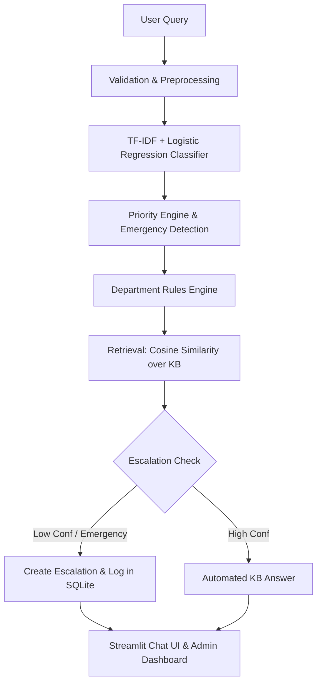

# Architecture Flowchart (Mermaid)

```mermaid
graph TD
    A[User Query] --> B[Validation & Preprocessing]
    B --> C[TF-IDF + Logistic Regression Classifier]
    C --> D[Priority Engine & Emergency Detection]
    D --> E[Department Rules Engine]
    E --> F[Retrieval: Cosine Similarity over KB]
    F --> G{Escalation Check}
    G -->|Low Conf / Emergency| H[Create Escalation & Log in SQLite]
    G -->|High Conf| I[Automated KB Answer]
    H --> J[Streamlit Chat UI & Admin Dashboard]
    I --> J
```
